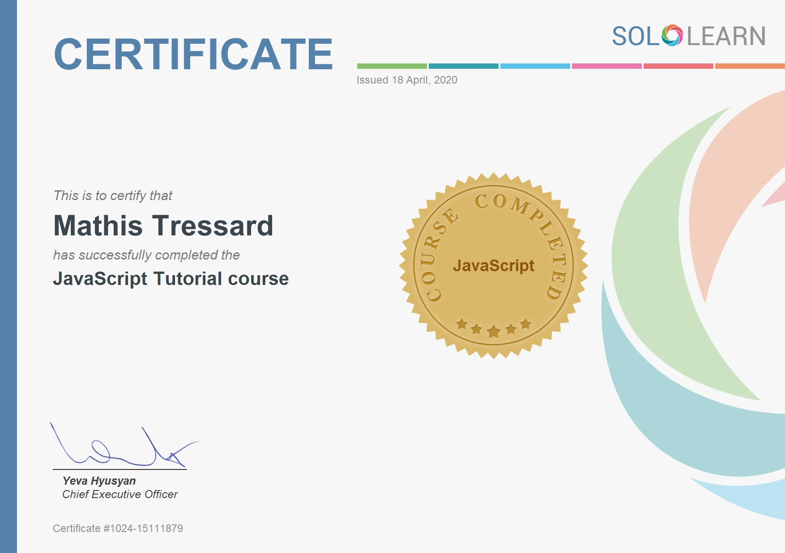

# SoloLearn

SoloLearn is a web/mobile app to learn to code for free   
See my [SoloLearn profile](https://www.sololearn.com/Profile/15111879o) and for more informations check [SoloLearn website](https://www.sololearn.com/)

You can find below my progression :

## HTML (100%)

## CSS (100%)

## Javascript (100%)

## PHP (25%)

Work in progress...

## React + Redux (10%)

Work in progress...